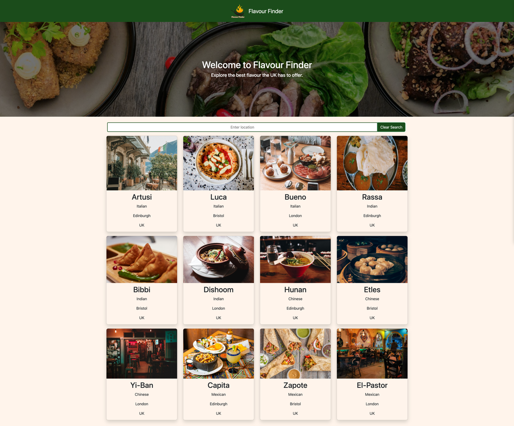

# Flavour-Finder-App
Welcome to Flavour Finder, your go-to website for discovering tasty cuisine near you!
## Description
Flavour Finder is designed for food enthusiasts who want to explore the best local restaurants in their area. The website provides essential details about each restaurant, including its location, cuisine type, and user reviews. Users can also contribute by submitting their own reviews after trying a restaurant.
## Table of Contents
- Technology Used
- Features
- Usage
- Screenshot
- Deployment
- Contributing
- License
## Technology Used
- HTML
- CSS
- Libraries; Font Awesome
- JavaScript
- React
- React Router
- Node.Js
- [Google Places auto complete api](https://www.npmjs.com/package/react-google-places-autocomplete)
- Netifly
- Github
- [Custom Api for Restaurant](https://github.com/EDXBootcamp/flavourfinderApi)

## Features
- Hero Section With Image
- Nav bar with Logo
- List of Restaurant from api
- Reviews of Restaurant

## Usage
The Flavour Finder App is designed to be user-friendly, allowing you to effortlessly explore and discover local restaurants. Here’s how you can make the most of it:
1. Search for Restaurants:
- Utilize the filter to find restaurants based on locations.
- Explore the list of restaurants presented with detailed information on each.
2. View Restaurant Details:
- Click on individual restaurant cards to access more information, including location, cuisine type, and user reviews.
3. Submit Reviews:
- Share your dining experiences by submitting reviews for the restaurants you’ve visited.
- Help the community make informed choices by reading and contributing to restaurant reviews.

## Screenshots

## Deployment
The Flavour Finder App is deployed using Netlify for seamless accessibility. You can access the app by visiting the following link: Flavour Finder App.
To run the app locally:
1. Clone the repository:
```bash
git clone https://github.com/your-username/Flavour-Finder-App.git
```
2. Install dependencies:
```bash
npm install
```
3. Start the app:
```bash
npm start
```
4. Open your web browser and go to http://localhost:3000 to experience Flavour Finder locally.
Feel free to contribute and enhance the app by following the steps outlined in the “Contributing” section above.
Happy exploring and dining! :hamburger::ramen::cake:


## Contributing
If you would like to contribute to this project, please follow these steps:
1. Fork the repository.
2. Create a new branch for your feature or improvement.
3. Make changes and submit a pull request.


## About the creators
This repository was originally created as a collaborative group project made by;
- [Tj Thouhid](https://github.com/tjthouhid)
- [Danté Kellman-Thompson](https://github.com/DKT15)
- [Mst Bilkis Naher](https://github.com/Bilkis2023)
- [Jake Henry](https://github.com/jakewshenry)
- [Émile Siou](https://github.com/Sooey-99)
- [Natasha](https://github.com/Tashsn)

## License
This project is licensed under the [MIT License](LICENSE).